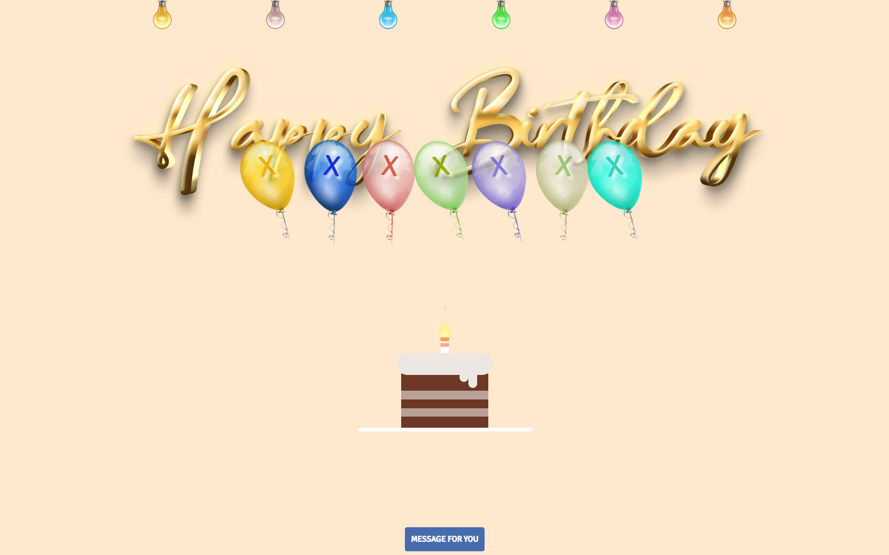

# 🎉 Birthday Wish E-Greeting Website 🎂

Welcome to the **Birthday Wish E-Greeting** project — a sweet, vibrant, and customizable way to send heartfelt birthday wishes through a beautifully designed website. This site is a perfect blend of style and sentiment, built with love using HTML, CSS, Less, and JavaScript.

🔗 **Live Site:** [urmi272.github.io/HBday](https://urmi272.github.io/HBday)

---

## ✨ Features

- 🎂 Aesthetic and responsive birthday greeting webpage  
- 🎶 Surprise animations and playful interactions  
- 🧁 Personalizable messages and vibrant design  
- 📱 Mobile-friendly design for sharing on the go  
- 🌈 Smooth user experience with interactive UI elements  

---

## 🛠️ Tech Stack

| Language     | Usage            |
|--------------|------------------|
| **CSS**      | Styling and animations |
| **JavaScript** | Interactivity and DOM manipulation |
| **Less**     | CSS preprocessing and design flexibility |
| **HTML**     | Page structure and content |

---

## 🚀 How to Use

1. **Visit the site**:  
   [Click here](https://urmi272.github.io/HBday) to open the live birthday greeting.
2. **Customize**:  
   Fork this repo and personalize the messages, design, or animations to make it your own unique greeting site!
3. **Share it**:  
   Copy the link and send it to your friend/family member on their birthday 🎈

---

## 📸 Preview

  

---

## 💡 Inspiration

Inspired by the joy of connecting with loved ones, I created this website to make birthday wishes more personal and special. This project was created to blend creativity with code — turning a simple birthday message into a memorable digital surprise. The idea was to create something joyful, shareable, and easy to customize.

---

## 🧁 Contributing

Got ideas for fun new animations or better UI?  
Contributions are welcome! Fork this repo and feel free to open a pull request. ✨

---

## 📬 Connect

Made with ❤️ by [Urmi](https://github.com/urmi272)  
Let’s spread more smiles, one birthday at a time 🥳

